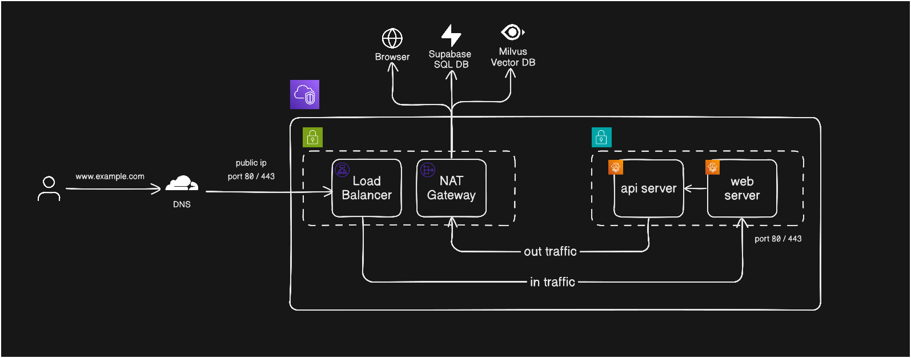

# Cloud Architecture
This describes how the application will be deployed to the cloud using cloud services from AWS (Amazon Web Services) and other services needed.

## Rationale
The main reason behind the design comes from the use case of the project. The project will only be used for demo purposes where the application will only be live for a limited time for a limited users (needing their pulbic IP to access). Thus, the design heavily considers the following factors such as costs and security while also considering ease of scalability and availability in the future.

## Architecture

The architectural design demonstrates how a request from a user is being handled in the cloud.
1. The request is handled by Cloudflare which we use as our DNS provider. This service will be responsible for routing the specific URL (subdomain + domain name) to the generated DNS name where the application is deployed.

    ```
    www.example.com -> generated DNS name of load balancer
    ```

    Cloudflare also offers multiple security and vulnerability protection services that are still in scope of the free tier, making it the best first line of defense against vulnerabilities from the internet.
2. The Load balancer will then route the request to the `web-server` that resides inside the private sub network through the server's specific port. Load balancer will act as a router for the request in order to reach the correct service that is hosted inside the private subnet. The Load Balancer acts as a second layer of defense by terminating SSL/TLS traffic (stripping invalid encryption attempts) and using AWS Security Groups to strictly control ingress traffic. It also performs protocol validation, dropping malformed HTTP requests before they can reach the application logic.
3. Web server will then process the request accordingly. It can communicate with the `api-server` via AWS Cloud Map (internal service discovery) to request or process specific data that also resides on the same network, which is in the private subnet. If the request have been satified, the response will be sent back to the load balancer, then to the user.
4. API server have the following needs such as access to the browser for web scrapping feature, and accessing different external databases that are deployed in the cloud. These needs requires access to the internet, which is not available when hosted inside private subnet. Thus, NAT gateway is introduced. The gateway is placed also in the public subnet in order to make requests to the internet (public). This then acts as the only route the API can use in order to make requests to the internet while still making the whole service secure inside the private subnet.

## Resources
The cloud diagram includes the following services used in order to satisfy the requirements:
- AWS Load Balancer - request (in-traffic) handling
- ECS Fargate - for deploying the app services into a machine
- AWS Cloudwatch Logs - for logs
- AWS Systems Manager Parameter Store
- AWS VPC - for setting up private and subnets inside a single network
- AWS Security Groups - for managing in and out traffic firewall
- AWS NAT Gateway - for managing out-traffic from the api server
- AWS ECR - for storing docker images for our app services
- AWS ECM - for managing SSL/TLS certificates
- Cloudflare DNS - for DNS and network-level security
- Supabase - for our relational database
- Milvus - for our vector database

## Cost Breakdown
The breakdown includes the persssion deployment of the application and the monthly recurring costs for use of storage.

### Cost per 2 hours session
These are the costs for every 2 hours the whole app is deployed in the cloud and to be used by specific users.
| Resource | Pricing (Sydney ap-southeast-2) | Usage | Est. Cost (2 Hours) |
| :--- | :--- | :--- | :--- |
| **NAT Gateway** | $0.059/hr | 2 Hours | **$0.12** |
| **NAT Data Proc.** | $0.059/GB | ~0.5 GB (Scraping/Images) | **~$0.03** |
| **ALB (Load Balancer)**| $0.0252/hr | 2 Hours | **$0.05** |
| **ALB LCU** | $0.008/LCU-hr | Negligible traffic | **<$0.01** |
| **Fargate vCPU** | ~$0.0465/vCPU-hr | 2 Tasks (0.5 vCPU ea) | **~$0.10** |
| **Fargate Memory** | ~$0.0051/GB-hr | 2 Tasks (1 GB ea) | **~$0.01** |
| **Data Transfer** | $0.114/GB (Out) | Negligible | **<$0.01** |
| **TOTAL** | | | **~$0.32 (Php 18.96)** |


### Fixed Recurring Monthly Costs (Dormant State)
These are the costs that keeps the project "ready to deploy".

| Resource | Pricing (Sydney ap-southeast-2) | Usage (Estimated) | Monthly Cost |
| :--- | :--- | :--- | :--- |
| **AWS ECR (Docker Images)** | $0.10 per GB / month | ~500MB - 1GB (1-2 images) | **~$0.10** |
| **CloudWatch Logs (Storage)** | $0.03 per GB / month | Minimal text logs | **<$0.01** |
| **SSM Parameter Store** | Standard Tier | < 10,000 parameters | **$0.00 (Free)** |
| **Supabase (Database)** | Free Tier | < 500MB | **$0.00 (Free)** |
| **Milvus (Vector DB)** | Free Tier | Starter Cluster | **$0.00 (Free)** |
| **Cloudflare DNS** | Yearly Subscription | 1 Domain | **$0.82 / year or $0.068 (Php 4.03) /month** |
| **TOTAL RECURRING** | | | **~$0.178 (Php 10.55) / month** |

### Sample Calculation
(Peak usage) 15 day with 2 hours runtime each in a month:
```
15 * (2 / 2 hrs per session costing) * Php 18.96      = Php 284.4
Php 284.4 + 10.55 (recurring cost)                    = Php 294.95 
Total                                                 = Php 294.95 / month
```